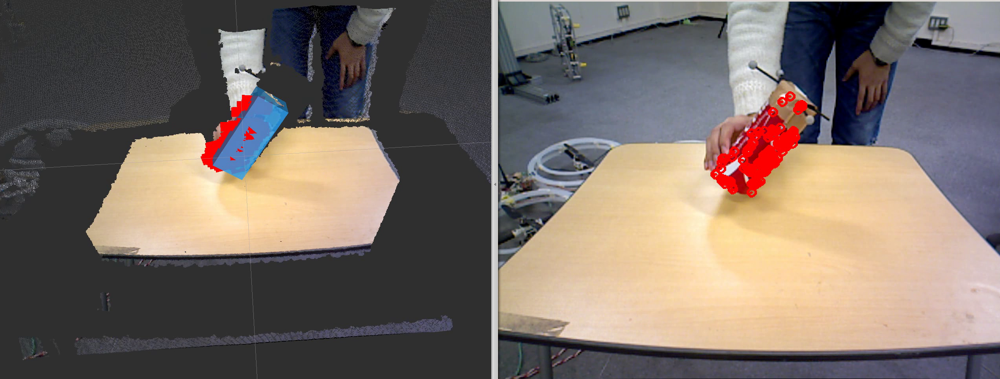

# FlowTracking

Calculate 3D Optical Flow from image and pointcloud and Track translation and rotation of objects.
The regions of object are described in 'jsk_recognition_msgs/BoundingBox'. Initial state of objects are given by '~input/box'.

## Subscribing Topic
* `~input` (`sensor_msgs/PointCloud2`)

  Input pointcloud. It needs to be organized.

* `~input/image` (`sensor_msgs/Image`)

  Input image.

* `~input/box` (`jsk_recognition_msgs/BoundingBoxArray`)

  Input bounding box. Objects track result is calculated from this input and movement calculated from optical flow.

## Publishing Topic
* `~output/flow` (`jsk_recognition_msgs/Flow3DArrayStamped`)

  Output 3D Optical Flow.

* `~output/image` (`sensor_msgs/Image`)

  Output image of flow drawed on input image.

* `~output/visualized_flow` (`visualization_msgs/Marker`)

  Output flow for Rviz. This topic is exaggerated to make it easy to see and published only when `publish_marker` is `true`.

* `~output/boxes` (`jsk_recognition_msgs/BoundingBoxArray`)

  Output of objects track result.

## Advertising Service
* `~initialize` (`std_srvs/Empty`)

  Initialize corners to calculate flow. This Service is advertised only when `tracking_mode` is `true`.

## Parameters
* `tracking_mode` (Boolean, default: `true`)

  When this parameter is set `true`, flow is calculated for corners found in initial frame. When `false`, corners to calculate flow are replaced in every frame.

* `approximate_sync` (Boolean, default: `true`)

  When this parameter is set `true`, `~input` and `~input/image` are synchronized with approximate time policy.

* `publish_marker` (Boolean, default: `true`)

  Toggle marker publishing.

* `maxCorners` (Integer, default: `100`)
* `qualityLevel` (Double, default: `0.05`)
* `minDistance` (Double, default: `5.0`)
* `blockSize` (Integer, default: `3`)

  Parameters of [cv::goodFeaturesToTrack](http://docs.opencv.org/2.4/modules/imgproc/doc/feature_detection.html#goodfeaturestotrack)

* `subPixWinSize` (Integer, default: `15`)

  Parameter of [cv::cornerSubPix](http://docs.opencv.org/2.4/modules/imgproc/doc/feature_detection.html#cornersubpix)

* `winSize` (Integer, default: `20`)
* `maxLevel` (Integer, default: `5`)

  Parameters of [cv::calcOpticalFlowPyrLK](http://docs.opencv.org/2.4/modules/video/doc/motion_analysis_and_object_tracking.html#calcopticalflowpyrlk)